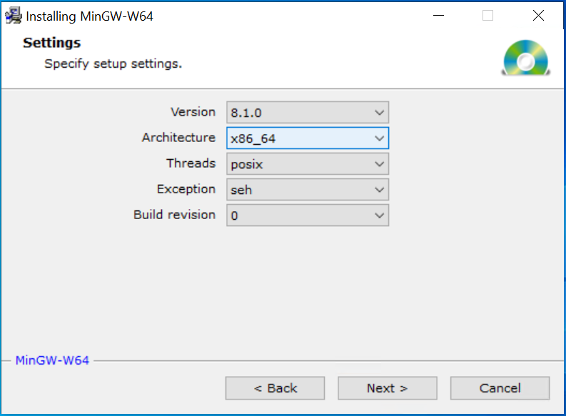

# cx-game
Game Prototype
---

CX game is a new 2D console game.

## Table of Contents

   * [Installation](#installation)
      * [Compiling on Linux](#compiling-on-linux)
      * [Compiling on MacOS](#compiling-on-macos)
      * [Simple Windows Install](#simple-windows-install)
      * [Compiling on Windows](#compiling-on-windows)
   * [Resources and libraries](#libraries-used)

---
## Installation
cx-game requires Golang version of `1.4+`

## Compiling on Linux
Install dependencies with
```
sudo apt update
sudo apt install -y glade xvfb libxinerama-dev libxcursor-dev libxrandr-dev libgl1-mesa-dev libxi-dev libperl-dev libcairo2-dev libpango1.0-dev libglib2.0-dev libopenal-dev libxxf86vm-dev make

```
### Install Go
* Go to [Go Downloads](https://golang.org/dl/) and download from the featured downloads for linux, something like `go1.16.2.linux-amd64.tar.gz`
* Extract the archive and install, you may require root or sudo \
For example: \
   ```rm -rf /usr/local/go && tar -C /usr/local -xzf go1.16.2.linux-amd64.tar.gz```
* Add /usr/local/go/bin to the PATH environment variable. \
Or just use this for a quick check \
```export PATH=$PATH:/usr/local/go/bin```
* Verify that you've installed Go by opening a command prompt and typing the following command: `go version`\
\
Following [this](https://golang.org/doc/install) for more.

#### Install `git` using apt

```bash
sudo apt update
sudo apt install git
```
You can use any other code editor, for installing sublime run these commands:
#### Install `sublime` using apt
```bash
sudo apt update
sudo apt install sublime-text
```

### Usage
Run the program.
```bash
git clone https://github.com/skycoin/cx-game.git
cd cx-game
go mod download
go run main.go
```
A window should appear, with a cat use `a`, `s`, `d`, `w` to move the cat around.\
\
Open source code in editor
```!bash
cd cx-game
subl ./
```

## Compiling on MacOS
### Install Go
* Go to [Go Downloads][golang] and download from the featured downloads for Apple macOS, something like `go1.16.2.darwin-amd64.pkg`
* Open the package file you downloaded and follow the prompts to install Go.
* Verify that you've installed Go by opening a command prompt and typing the following command: `go version`\
Following [this](https://golang.org/doc/install) for more.

#### Install `git` with brew

```!bash
brew insall git
```

#### Install `sublime` with brew
```!bash
brew install --cask sublime-text
```

### Usage
Run the program.
```bash
git clone https://github.com/skycoin/cx-game.git
cd cx-game
go mod download
go run main.go
```
A window should appear, with a cat use `a`, `s`, `d`, `w` to move the cat around.\
\
Open source code in editor
```!bash
cd cx-game
subl ./
```

## Simple Windows Install
* Go to [Go Downloads][golang] and download from the featured downloads for Microsoft Windows, current version is `go1.16.3.windows-amd64.msi`
* Clone the repository using `git clone https://github.com/skycoin/cx-game.git`
* Go to the root directory and open your terminal (Powershell / cmd)
* Run `go mod download` to get all dependencies
* Run `go run main.go` to run the program, a window should appear with a cat, use `a`, `s`, `d`, `w` to move the cat around

## Compiling on Windows
### Install Go
* Go to [Go Downloads][golang] and download from the featured downloads for Microsoft Windows, something like `go1.16.2.windows-amd64.msi`
* Open the package file you downloaded and follow the prompts to install Go.
* Verify that you've installed Go by opening a command prompt and typing the following command: `go version`\
Following [this](https://golang.org/doc/install) for more.

#### Install `git` from executable
* Download git from [git-scm.com][git-scm]
* Open the executable and follow the prompt to install git.

#### Install `sublime` from executable
* Go to sublime [downloads page][sublimetext]
* Download the executable for windows
* Open the executable and follow the prompts to install sublime.

#### Install `MinGW`
* Download MinGW installer from [here][mingw_online]
* Open the executable and follow the instructions.
* Select **Architecture = x86_64** as show in the picture. 
* Now go to the installed directory and run **mingw-w64.bat** to add mingw to PATH.

### Usage
Opening terminal
1. Click the Start menu.
2. In the menu's search box, type cmd, then press the Enter key.
3. In the Command Prompt window that appears, type the following command:

Run the program from terminal
```bash
git clone https://github.com/skycoin/cx-game.git
cd cx-game
go mod download
go run main.go
```
A window should appear, with a cat use `a`, `s`, `d`, `w` to move the cat around.\
\
Open source code in editor
* Open sublime text editor
* Drag and drop cx-game folder into sublime text editor

---

## Libraries Used

- [glfw](github.com/go-gl/glfw/v3.3/glfw)
- [gl](github.com/go-gl/gl/v2.1/gl)


## Contributing
Pull requests are welcome. For major changes, please open an issue first to discuss what you would like to change.

Please make sure to update tests as appropriate.

<!-- Links -->
<!-- Usage: [Your text][link variable] -->
[golang]:https://golang.org/dl/
[git-scm]:https://git-scm.com/download/win
[sublimetext]:https://www.sublimetext.com/3
[mingw_online]:https://sourceforge.net/projects/mingw-w64/files/Toolchains%20targetting%20Win32/Personal%20Builds/mingw-builds/installer/mingw-w64-install.exe
